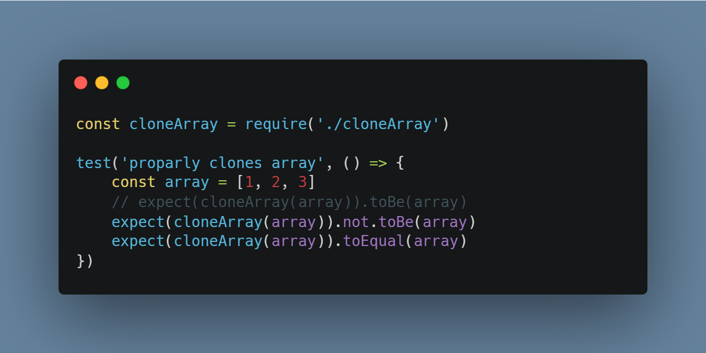


# Test in Vanila, Jest
In order to get familliar with Tests, I decided to have three simple funcitons in Vanila and to test them with Jest. 
The main goal here was to understand what stands behind the scenes and basically writting the syntacs for the first time. 



## About the tests
Some details about the tests I've made

- Sum and Subtract functions, each one in a different folder with its' own test file. 
- Clone array function that required me to use some unique matchers to get my final result. 

## Getting started
Clone the project or dowload the files on top.
```
git clone https://github.com/OriBenAmram/VanilaTestProj.git
```
Open the terminal and enter the following lines to run it locally on your computer:
```
npm i
npm run test
```
You supposed to see that the tests are running (in the terminal), and three out of three should be passed. 


## Take it to the next step
There are many different videos and guides to get deeper into Testing.
[Try this guy](https://www.youtube.com/watch?v=7r4xVDI2vho&t=21s "link route - https://www.youtube.com/watch?v=7r4xVDI2vho&t=21s"), he explains it from scratch and also in Vanila.

Next, I recommand you to take it to your framework.
I did it with React and created a simple authentication test. There I dived deeper into the syntacs, using "describe" for example and how it all work with a large project.

For that, I created [this project](https://github.com/OriBenAmram/LoginWithTests "link route - https://github.com/OriBenAmram/LoginWithTests") in which I also used Jest, only this time I focused on a specific part of the App (authentication and disable a button). Take a look and keep moving forward :)
